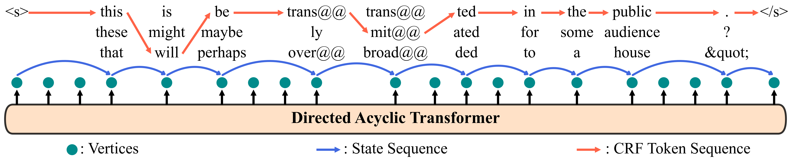

# DAT-CRF

This repository accompanies our ECAI 2025 paper:
_DAT-CRF: Improving the Directed Acyclic Transformer with CRF Integration_

Our code is based on [fairseq](https://github.com/facebookresearch/fairseq) and [DATransformer](https://github.com/thu-coai/DA-Transformer).
**Please make sure to install the specific version of fairseq provided in this repository.**



## 🧠 Model Code

The implementation of our model can be found in:
* `fairseq_plugins/DATransformer/models/dacrf_transformer.py`
* `fairseq_plugins/DATransformer/models/dacrf_transformer_doc.py`

## 🚀 Baseline DAT Training

To train a baseline DAT model on the IWSLT14 dataset, run:
```bash
  python run.py train dacrf_transformer iwslt14_de_en
```
Trained models will be saved under: `experiments/fairseq/iwslt14_de_en/dacrf_transformer/`

To train the DAT model with `\lambda=8`, you can simply run:
```bash
  python run.py train dacrf_transformer iwslt14_de_en \
  --upsample-scale 8
```


## 📈 CRF Fine-tuning

Once the baseline DAT model is trained, follow these steps to train our DAT-CRF model:
  1. Create a new folder named `dacrf_transformer_finetune` inside the pretrained model directory
  2. Move the `checkpoint_best.pt` file into `dacrf_transformer_finetune/` and rename it to `checkpoint_finetune.pt`.
  3. Run the fine-tuning command:
```bash
  python run.py train dacrf_transformer_finetune iwslt14_de_en
```

## 📊 Evaluation

To evaluate the DAT-CRF model and test different decoding strategies, run:
```bash
  python run.py generate dacrf_transformer_finetune iwslt14_de_en \
   --model-overrides.decode_strategy@str=(greedy|lookahead|beamsearch|full-crf) \
   --model-overrides.crf_disabled@bool=True
```
To enable CRF-based Viterbi decoding on top of greedy or lookahead decoding, simply set: `--model-overrides.crf_disabled@bool=False`.
These add-on decoding methods are expected to perform worse than our jointly optimised decoding method `full-crf`, where the graph trajectory and observation sequence are decoded simultaneously.

To evaluate with different CRF beam sizes, use `--model-overrides.crf_decode_beam@int=8`

For decoding with different token beam approximation (e.g., `K=8` in our paper), you can simply override the default setting using `--model-overrides.crf_decode_beam@int=8`

You may also run:
```bash
  python run.py fairseq_generate dacrf_transformer iwslt14_de_en --model-overrides.decode_strategy@str=(greedy|lookahead)
```
to compare the output of the original non-autoregressive observation model.
This should produce results identical to those of the DAT-CRF model when using the same decoding methods, as our fine-tuning does not alter the underlying base model.

## ⚙️ Additional Configurations

For more training and evaluation options, please refer to: `awesome_fairseq/translation_nat/da_transformer.py`.
